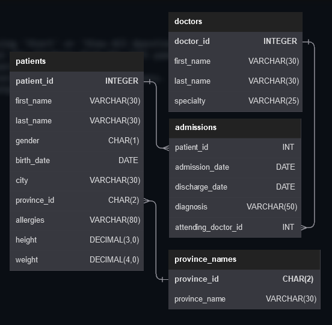
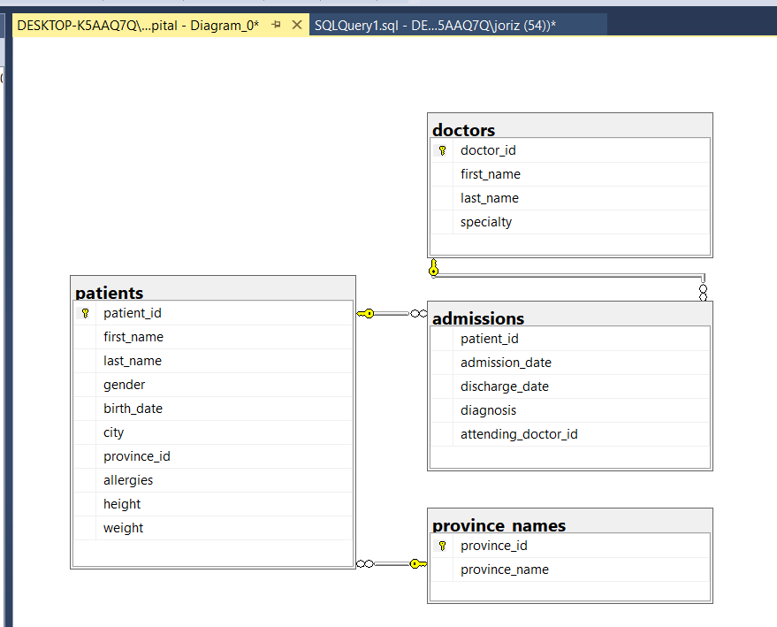

## Esquema con modelo de Base de Datos a armar

## Script con comandos para crear una base de datos, sus tablas y sus relaciones

~~~sql
-- Crear la base de datos
CREATE DATABASE hospital;
GO

-- Usar la base de datos
USE hospital;
GO

-- Crear la tabla province_names primero (porque será referenciada por patients)
CREATE TABLE province_names (
    province_id   CHAR(2)      PRIMARY KEY,
    province_name VARCHAR(30)  NOT NULL
);
GO

-- Crear la tabla doctors (porque será referenciada por admissions)
CREATE TABLE doctors (
    doctor_id    INTEGER      PRIMARY KEY,
    first_name   VARCHAR(30)  NOT NULL,
    last_name    VARCHAR(30)  NOT NULL,
    specialty    VARCHAR(25)  NOT NULL
);
GO

-- Ahora crear la tabla patients que hace referencia a province_names
CREATE TABLE patients (
    patient_id    INTEGER      PRIMARY KEY,
    first_name    VARCHAR(30)  NOT NULL,
    last_name     VARCHAR(30)  NOT NULL,
    gender        CHAR(1)      NOT NULL,
    birth_date    DATE         NOT NULL,
    city          VARCHAR(30),
    province_id   CHAR(2)      NOT NULL,
    allergies     VARCHAR(80),
    height        DECIMAL(3,0),
    weight        DECIMAL(4,0),
    CONSTRAINT FK_patients_province FOREIGN KEY (province_id) REFERENCES province_names(province_id)
);
GO

-- Finalmente, crear la tabla admissions que referencia a patients y doctors
CREATE TABLE admissions (
    patient_id          INT          NOT NULL,
    admission_date      DATE         NOT NULL,
    discharge_date      DATE,
    diagnosis          VARCHAR(50),
    attending_doctor_id INT          NOT NULL,
    CONSTRAINT FK_admissions_patient FOREIGN KEY (patient_id) REFERENCES patients(patient_id),
    CONSTRAINT FK_admissions_doctor FOREIGN KEY (attending_doctor_id) REFERENCES doctors(doctor_id)
);
GO
~~~

## Esquema final en SQL Server

        

